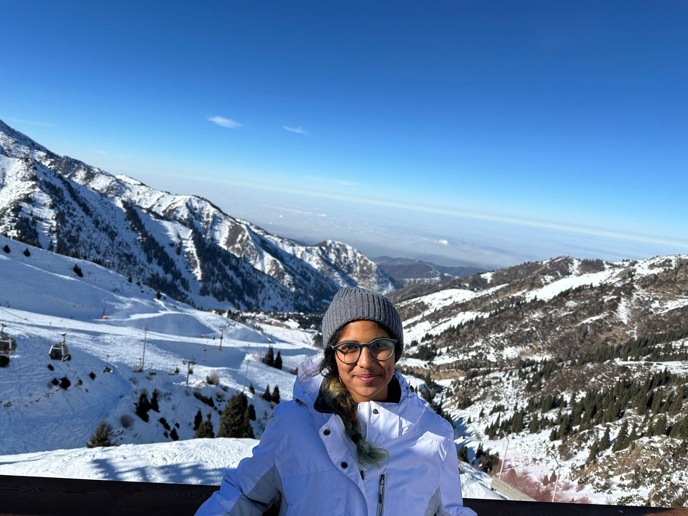

# Sam Vinu-Srivatsan
## Class of 2027, Course 6-2: EECS
Hi! I'm a second-year MIT undergraduate from San Francisco, CA. I'm looking forward to learning fullstack development through 6.1040! I love good coffee/tea :tea:, running and hiking :mountain:, reading :book:, and public transportation! :train:

    <h1 style="text-align:center;">FAQ</h1>
    <b> 
Question
 </b>
    <i> 
Answer
 </i>
    <b> 
Question
 </b>
    <i> 
Answer
 </i>
    <b> 
Question
 </b>
    <i> 
Answer
 </i>

<a rel="mailto:samhita@mit.edu">samhita@mit.edu</a>
