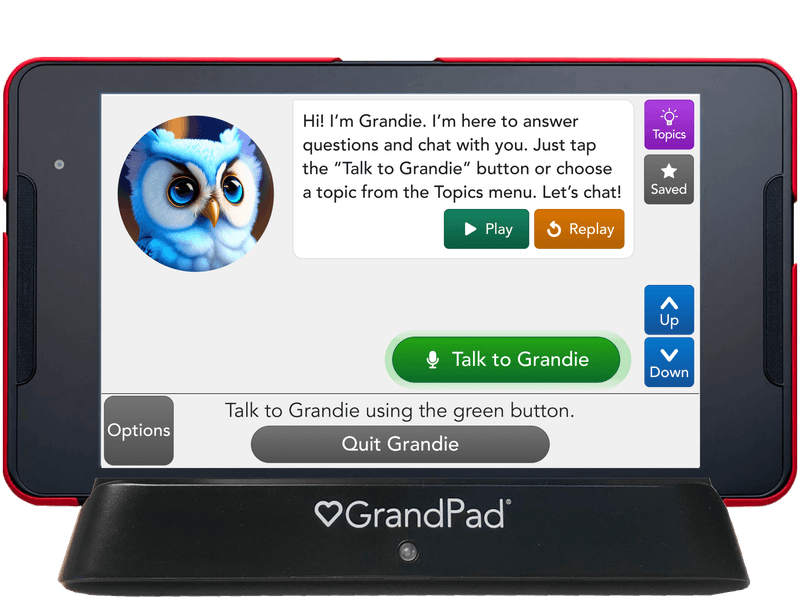

# 1. Broad application goals
**App Name:** GenSpeak
**Intended Audience:** Family members or friends across different generations, preferably with different first languages or a language barrier.
**Value:** Current social media apps are powerful, multifaceted ways to connect with so many people across the world. However, each app usually has a high concentration of a specific demographic: Facebook is more common among Gen X, Instagram among Millenials and Gen Z, and TikTok among Gen Z and Gen Alpha. Despite built-in translation features, people also cluster based on their language and nationality. GenSpeak is built for much communities that are both smaller and more generationally and linguistically diverse, such as immigrant families. It will focus on intuitive, universally usable app design and more photo, video, and audioclip capability than attemps at direct translations.

# 2. Scrapbook of comparables

# add captions

# 3. Brainstorming feature ideas

**1. Story Swap**
Users from different generations can share personal stories, cultural experiences, or memories. Users can request or provide context to better understand the time period or culture behind the story.

**2. Cross-Generational Book Club**
Users from different generations recommend books, discuss literature, and share reading lists from different periods and cultures on a forum or digital book club.

**3. Language Mentor Match**
Match users who want to learn each other's native language. Grandchildren in other countries can learn about their native languages and traditions. Older generations can teach cultural context, and younger users can help with modern slang or terminology.

**4. Generational Challenges**
Participate in weekly challenges and collect a streak! These challenges encourage intergenerational collaboration and culture swap, like sharing music, movie/book recommendations, or trending content from each generation.

**5. Interactive Time Capsules**
Contribute photos, videos, and stories from different parts of your life and different decades to create interactive time capsules. Save them to show future generations and share with family members to learn more about heritage and history without a languae barrier.

**6. Language Learning Through Memes**
Share memes in different languages with translations and explanations. This makes language learning more humorous and accessible!

**7. Generational Jargon Translator**
Built-in tool to explain slang, idioms, or pop culture references. This could work like a glossary, where slang or generational terms are highlighted and defined when they pop up in others' posts or messages.

**8. Voice-to-Text Translation**
Voice messages are automatically translated into text for recipients in their native language. This is useful for older users who may prefer speaking over typing, while allowing younger generations to text. It may include emoji reactions.

**9. Generational “Wisdom Wall”**
Formatted like a Padlet ("sticky note posts") or Reddit (with upvoting capabilities) where older generations can share life advice, experiences, or lessons learned. Younger users can ask questions, and responses can be voted on and shared.

**10. Linguistic/Cultural Trivia**
Find partners and play a trivia game to see who knows the most about language, history, and culture from different generations and regions! Custom questions allow family and friends to learn more about each other.

**11. Skills Exchange**
Family members can share recipes or skills. Younger users can teach tech skills and older users can teach history, tradition, or classic skills (e.g., knitting, cooking).

**12. Multilingual Karaoke**
Formatted like Houseparty where users can join a karaoke video call or play a song and lyrics on their phone to sing with friends/family in-person. Users can choose from a song bank in different languages with accurate lyric translations.

**13. Hobby Matchmaking**
Formatted like Tinder, swipe and match with family members or users with similar hobbies or interests, such as gardening, technology, or sports. Connect via video or text to discuss shared passions or use a calendar feature to plan a hangout togethe. This focuses on activities instead of the pressure of speaking perfectly in each other's native languages.

**14. Timeline Collaboration**
Users in a family group can contribute to a collective timeline of global events or family events, adding personal memories or cultural context from their generation’s perspective.

**15. Cultural Celebration Calendar**
Description: A calendar that highlights holidays, traditions, and festivals from various cultures, religions, and generations. This can include the Lunar, Gregorian, Panchanga (Hindu) calendars and more! Users can share stories, photos, and videos explaining what those celebrations mean to them.

# 4. VSD Analysis
1. Criterion: Stakeholders, Prompt: Consider Children, Features: Skills Exchange, Language Mentor Match
    a.
    b.

2. Criterion: Time, Prompt: Sustained Friendships, Features:
    a.
    b.

3. Criterion: Pervasiveness, Prompt: Political Realities, Features:
    a.
    b.

4. Criterion: Pervasiveness, Prompt: Crossing National Boundaries, Features:
    a.
    b.

5. Criterion: Values, Prompt: Value Tensions, Features:
    a.
    b.
