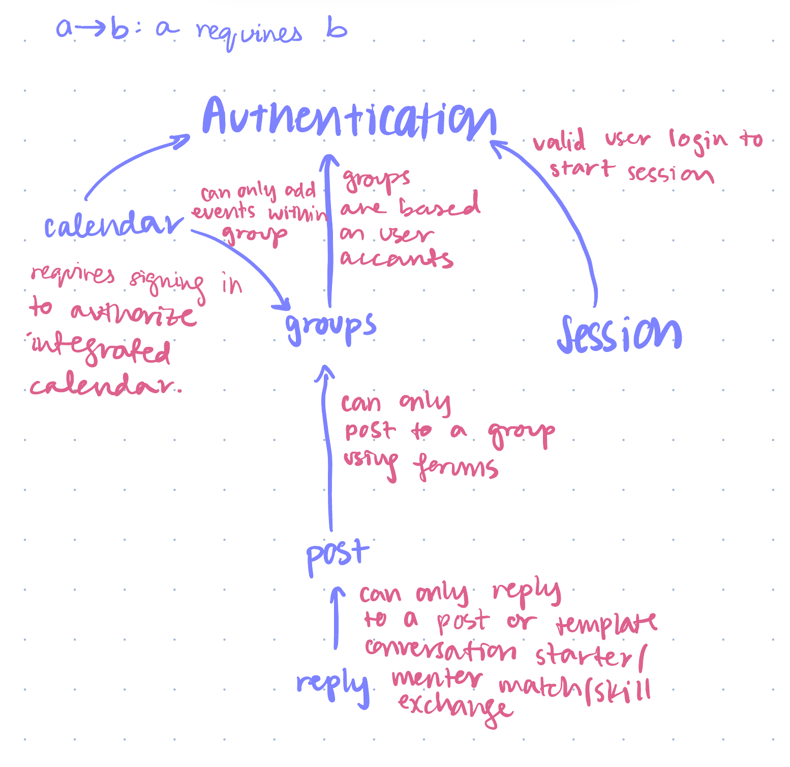

wiref# Pitch
### GenSpeak: Bridging Generations Through Shared Stories and Cultures

GenSpeak brings family members and friends together across generations and languages. Tailored for multi-generational and immigrant families, GenSpeak fosters deep, meaningful communication by allowing users to share stories, traditions, and experiences in an intuitive environment.

At the heart of GenSpeak are its Posts and Replies. Users can create posts from pre-made template conversation-starters that highlight cultural insights and personal memories, ensuring visibility is tailored to group membership. Conversations remain private and meaningful. Users can add replies to engage in discussions, creating dialogue within family groups.

To ensure a secure experience, GenSpeak features robust Authentication and Session management. Users register and log in to create a personalized space, while active sessions maintain a seamless flow of interaction.

The Cultural Celebration Calendar allows users to schedule and celebrate important events, integrating directly with posts and group discussions. Users can create events linked to their cultural traditions and invite family members, making it easy to stay connected and engaged.

By emphasizing collaboration and connection, GenSpeak transforms how families communicate across generations.
---

# Concepts

Define the app-level actions as synchronizations of concept actions, and instantiate generic concepts with appropriate types. Draw a dependency diagram showing the possible subsets.
## 1. Post

**state**
- `Posts`: a set of posts linked to users.
- `Visibility`: a set indicating which users can see each post.

**actions**
- `create (u: User, content: Text, media: Media)`:
  - add a new post linked to user `u` with specified content and media to `Posts`.

- `view (u: User, p: Post)`:
  - when `p` is in `Visibility` for user `u`, allow `u` to see the content of post `p`.

---

## 2. Reply

**state**
- `Replies`: a set of replies linked to each post.
- `Thread Visibility`: indicating which replies are visible to users.

**actions**
- `add (u: User, p: Post, content: Text)`:
  - when `p` is in `Visibility` for user `u`, add a reply to `Replies` linked to post `p` by user `u` with specified content.

- `view (u: User, p: Post)`:
  - when replies to `p` are in `Thread Visibility` for user `u`, allow `u` to see the responses to post `p`.

---

## 3. Authenticate

**state**
- `User Credentials`: a set of username and password pairs.
- `Authentication Status`: indicating whether a user is authenticated.

**actions**
- `register (u: User, password: Password)`:
  - add a new user `u` with specified `password` to `User Credentials`.

- `login (u: User, password: Password)`:
  - when `u` is in `User Credentials` with the matching `password`, set `Authentication Status` to authenticated.

---

## 4. Session

**state**
- `Active Sessions`: a set of currently active user sessions.
- `Session Timeout`: a timer indicating when a session will expire.

**actions**
- `start (u: User)`:
  - initiate a new session for authenticated user `u` and add to `Active Sessions`.

- `end (u: User)`:
  - terminate the session for user `u` and remove from `Active Sessions` after inactivity.

---

## 5. Calendar

**state**
- `Events`: a set of scheduled events that users can see.
- `User Access`: indicating which users have access to specific events.

**actions**
- `add (u: User, event: Event)`:
  - create a new event linked to user `u` and add to `Events`.

- `delete (u: User, event: Event)`:
  - when `event` is in `Events` and user `u` has access, remove `event` from `Events`.

---

## 6. Groups

**state**
- `Group Membership`: a set indicating which users belong to which groups.
- `Group Content`: a set of posts and calendar events accessible only to group members.

**actions**
- `create (creator: User, groupName: Text)`:
  - form a new group with `groupName` and add `creator` to `Group Membership`.

- `invite (creator: User, member: User, group: Group)`:
  - if `creator` is in `Group Membership` of `group`, send an invitation to `member` to join `group`.

# Dependency Diagram & Synchronizations



```
sync authenticationAndSession(user: User):
    if user.isAuthenticated():
        throw new Error("User is already logged into an account")
    if user.isInActiveSessions():
        user.accessContent({Posts, Replies, Groups, Calendar})
```

```
sync groupsAndPosts(user: User):
    if user.isInGroups():
        posts = user.getGroupPosts()
        user.view(posts)

```

```
sync groupsAndCalendar(user: User):
    if user.isInGroups():
        events = user.getGroupEvents()
        user.view(events)

```

```
sync postsAndReplies(user: User, post: Post):
    if post.isInGroupPosts() and user.isInActiveSessions():
        user.addReplyToPost(post)
        post.addReply(user.reply)
```

```
sync calendarAndEvents(user: User):
    if user.isInActiveSessions():
        user.addEvent()
        user.linkEventToGroups()
```

```
sync sessionAndVisibility(user: User):
    if user.session.isValid():
        visibleContent = user.getGroupContentIntersection({Posts, Replies, Events})
        user.setVisibility(visibleContent)
```

```
sync authenticationSync(user: User):
    if user.isAuthenticated():
        user.visibleContent = {Posts, Replies, Calendar} only if user.isInActiveSessions()
```

1. **Authentication and Session:**
   - If `User` is Authenticated, then `User` is in `Active Sessions`.
   - If `User` is in `Active Sessions`, then `User` can access `Posts`, `Replies`, `Groups`, `Calendar`.

2. **Groups and Posts:**
   - If `User ∈ Groups`, then `Posts ⊆ Group Posts`.
   - If `User ∈ Groups`, then `User` can view `Group Posts`.

3. **Groups and Calendar:**
   - If `User ∈ Groups`, then `Events ⊆ Group Events`.
   - If `User ∈ Groups`, then `User` can view `Group Calendar Events`.

4. **Posts and Replies:**
   - If `Post ∈ Group Posts` and `User ∈ Active Sessions`, then `User` can add `Reply` to `Post`.
   - If `User` adds `Reply`, then `Reply ∈ Replies(Post)`.

5. **Calendar and Events:**
   - If `User ∈ Active Sessions`, then `User` can add `Event`.
   - `Event ∈ User's Calendar` if linked to `User's Groups`.

6. **Session and Visibility:**
   - If `Session` is valid, then `User` can see `{Posts, Replies, Events} ∩ Group Content`.
   - `User Visibility ⊆ {Posts, Replies, Events}` based on `Group Membership`.

7. **Authentication Sync:**
   - `Authentication Status(User)` ⟹ `{Posts, Replies, Calendar}` visible only if `User ∈ Active Sessions`.

# Wireframes
### Here is a link to my Figma wireframe! Below is a screenshot of the flows between different frames.
Link: https://www.figma.com/design/IsYOPFe29EHQsblz2lNcdw/genspeak?node-id=0-1&t=WvlEejT9MctX4iCc-1
This wireframe demonstrates all six concepts: authentication (and session, which is connected), post, reply, groups, and calendar.


# Design tradeoffs.
(300 words total)
## Decision 1: Event Time!
Various options:
    - Integrate with Google Calendar (external event management)
    - Develop an in-app calendar (seamless user experience)
Why I chose this option over others (for now): Integrating with Google Calendar offers users familiarity and robust features like reminders and sharing. Connecting to Google via API to sign into my app also makes Authentication and Sessioning easier and better synchronizes many of my different concepts.

## Decision 2: Ready, set, login!
Various options:
  - Traditional username/password authentication.
  - Utilize social media login options (e.g., Google, Facebook).
Why I chose this option over others:
Social media logins streamline access and increase user acquisition. They also have better existing privacy infrastructure than I.

## Decision 3: Mom's gonna see you say that!
Various options:
  - Make all posts public within the app.
  - Restrict post visibility to group members only.
Why I chose this option over others:
Restricting post visibility to group members enhances privacy trust! This contributes to the familial feeling of the app, which encourages users to share sensitive cultural insights and personal stories.
