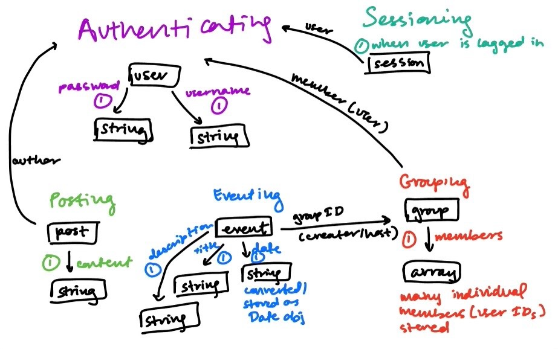

# ASSIGNMENT 4: Backend Design & Implementation

### App Definition

**App Name:** GenSpeak

### Concepts
- **Authenticating**
- **Sessioning** [Authenticating.User]
- **Posting** [Authenticating.User]
- **Replying** [Posting.Post]
- **CalendarEvent** [Authenticating.User]
- **Grouping** [Authenticating.User, Posting.Post, CalendarEvent.Event]
- **Eventing** [Grouping.Group, CalendarEvent]

### Abstract Data Models

1. **Post** [Post]
   - **Purpose:** Allow users to share content with the community.
   - **Core Functionality:** Users can create posts visible to others on the platform.
   - **Actions:**
     - `createPost(content: string, media: Media):` Add a post with the specified content and media.
     - `getUserPosts(username: string):` Retrieve all posts by a user.
     - `searchPostsByTitle(title: string):` Find posts matching or starting with a title.
     - `deletePost(postID: Post.ID):` Remove a specific post by its ID.
   - **State:**
     - Posts: A set of posts, each linked to a user.

2. **Reply** [Reply]
   - **Purpose:** Enable users to respond to posts in organized threads.
   - **Core Functionality:** Users can reply to posts and view replies based on visibility.
   - **Actions:**
     - `addReply(postID: Post.ID, content: string):` Add a reply to a specific post.
     - `viewReplies(postID: Post.ID):` View replies for a post.
   - **State:**
     - Replies: A set of replies linked to posts.
     - ReplyVisibility: Defines which users can view replies.

3. **Authenticate** [User]
   - **Purpose:** Handle user registration, login, and authentication.
   - **Core Functionality:** Users can create accounts and log in securely.
   - **Actions:**
     - `register(username: string, password: string):` Register a new user.
     - `login(username: string, password: string):` Authenticate a user.
   - **State:**
     - UserCredentials: A set of username-password pairs.
     - AuthStatus: Tracks whether a user is logged in.

4. **Session** [User]
   - **Purpose:** Manage active user sessions for continuous authentication.
   - **Core Functionality:** Users stay logged in across different pages until their session ends.
   - **Actions:**
     - `startSession(userID: User.ID):` Begin a session for a user.
     - `endSession(userID: User.ID):` End a user’s session.
   - **State:**
     - ActiveSessions: A set of ongoing sessions.
     - SessionTimeout: Timer for session expiration.

5. **Calendar** [Event]
   - **Purpose:** Schedule and manage events for users.
   - **Core Functionality:** Users can create, view, or delete events based on permissions.
   - **Actions:**
     - `addEvent(userID: User.ID, event: Event):` Add a new event.
     - `deleteEvent(eventID: Event.ID):` Remove an event.
   - **State:**
     - Events: A set of scheduled events.
     - EventAccess: Tracks which users can access specific events.

6. **Groups** [Group]
   - **Purpose:** Facilitate group-based activities and interactions.
   - **Core Functionality:** Users can form groups, invite others, and share content within the group.
   - **Actions:**
     - `createGroup(creator: User.ID, groupName: string):` Create a new group.
     - `inviteToGroup(groupID: Group.ID, memberID: User.ID):` Invite a user to a group.
   - **State:**
     - GroupMembers: Tracks which users belong to which groups.
     - GroupContent: Posts and events accessible only to group members.

7. **Eventing** [Grouping.Group, CalendarEvent]
   - **Purpose:** Manage events associated with groups, allowing users to create, edit, and manage events.
   - **Core Functionality:** Users can create events for groups, edit them, and manage attendees.
   - **Actions:**
     - `createEvent(groupID: Group.ID, event: Event):` Create a new event for a specific group.
     - `editEvent(eventID: Event.ID, updates: EventUpdates):` Edit an existing event.
     - `manageAttendees(eventID: Event.ID, attendees: User.ID[]):` Manage attendees for an event.
     - `getEventsByGroupID(groupID: Group.ID):` Retrieve events associated with a specific group ID.
   - **State:**
     - GroupEvents: A set of events linked to specific groups.
     - Attendees: A list of users attending each event.

## Design Reflection
My actual backend implementation in A4 ended up changing from ideas in A3. I discovered a lot of ambiguity when trying to separate the Grouping and Friending concepts and swap out the Calendaring and Eventing concepts.

I removed the Replying concept because it did not meet a need that posting and grouping did not already have. I switched Calendaring to Eventing. Instead of each user having a personal calendar, there is a synchronization between the Grouping and Eventing concepts such that a collection of events can be stored with a group. Group members can create, edit, or get a list of events in each of their groups by querying group ID.

I distinguish my Grouping concept from the Friending concept in the starter code. I diverged from A3 (1 group per user) to allowing users to join many groups. Users can connect with members from different backgrounds with increased customizability.

This not only impacts the technical implementation details, but also changes the premise of the app. Users can still plan events together to connect via Grouping and Eventing concepts. However, the emphasis is less on automatically scheduling cultural or language exchange events. While this makes it a more generic social media app, it was also more feasible.

 If I restarted my app, I might choose different concepts. Grouping is still a bit redundant with Friending. I'd replace it with a stronger focus on the premise of GenSpeak, which was to overcome language and generational barriers. This could have been through some kind of API connections to language learning sites, pre-existing holiday calendar templates, or one of the other ideas I had listed in my divergent design for A2.
