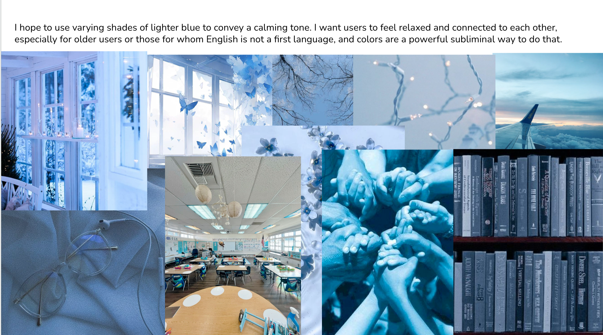
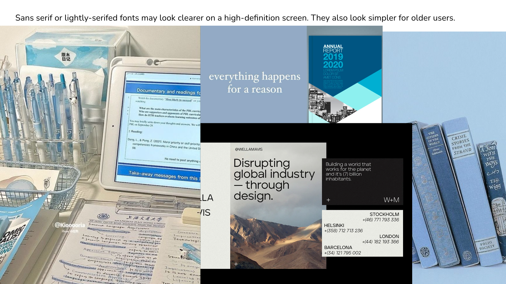

<b>Heuristic Evaluation</b>

# Usability Criteria

## Discoverability

### Consistent Navbar Navigation
The navigation bar remains visible across all pages, ensuring that key areas of the app—such as "Home," "Groups," and "Settings"—are easily accessible from anywhere in the app. This consistent placement allows users to quickly understand their purpose and find what they need without extra effort. Subpages within "Groups" (like posts, events, and scrapbook) are logically organized, making it easy for users to discover the sections within a group. The simple structure allows users, even those new to the app, to understand how to move through it without confusion.

**Potential Improvement**: Although the navbar is intuitive, tooltips on hover could be added to each navigation item to give first-time users additional context, helping them understand the function of each tab even more quickly.

### Clear Tab Views Organized by Group
Within each group, users can easily access different sections such as posts, events, and scrapbook. These sections are clearly separated and provide a straightforward way to navigate between content types. This ensures that users can find content associated with specific groups quickly and without frustration.

## Efficiency

### Reusable Components for Posts and Scrapbook Images
The app leverages reusable UI components for similar actions like creating posts and uploading images to the scrapbook. This streamlining not only reduces the learning curve for users but also makes backend operations more efficient. When a user learns how to interact with one feature, they can apply the same actions to other features, creating a smooth, predictable experience.

# Physical Heuristics

## Mapping

### Logical Button Placement
Buttons for essential actions, such as “Create Post” and “Search,” are placed logically, either just beneath or next to the corresponding content, reducing the effort required to find them. These buttons are color-differentiated with a slightly different shade of blue, drawing attention and making it easy for users to quickly identify where to click.

### Contextual Layout on Profile Page
The “Profile” page groups all account-related actions—like updating username or changing settings—into one area, making it intuitive for users to navigate their account settings. Users can easily scan the page to identify the task they want to perform.

**Potential Improvement**: While the layout is functional, using consistent spacing and alignment could improve the conceptual structure of the page. By grouping related tasks more clearly, users will be able to quickly understand where to go for different actions.

# Situational Context

### Highlighting Active Tab View in Groups
When users navigate between tabs (Posts, Events, Scrapbook) in a group, the active tab is highlighted in a distinct blue color. This color coding helps users track which section they are in. Additionally, page titles displayed at the top of each view reinforce this distinction, ensuring users always know where they are within the app.

### Dynamic Adaptation to State
On pages like the "Groups" page, when a user hasn’t joined any groups yet, a message like “No groups joined yet” is displayed, which helps avoid an empty or confusing screen. Similarly, on other pages like "Posts" or "Scrapbook," empty states are handled gracefully, showing prompts like “Start by creating your first post” or “Search for content to save.” These thoughtful messages guide users, preventing frustration from blank screens.

# Linguistic Level

## Speak a User’s Language

### Descriptive Labels and Prompts
The language used in the app is straightforward and user-friendly. Labels and prompts, such as "What’s on your mind?" on the "Create Post" page, provide clear, conversational guidance that is easy for users to understand. Error messages like “Group not found” are concise and actionable, offering a clear path forward without ambiguity.

### Feedback for User Actions
Whenever users perform an action, such as creating a post, saving content, or leaving a group, they receive immediate feedback in the form of confirmation toast messages like “Post created successfully!” or “Group left.” These messages not only inform users of successful actions but also do so in a friendly, approachable manner that reassures them that their tasks were completed.

# Consistency

## Unified Style and Layout
Although icons are not used, the app maintains a consistent style across interactive elements. Consistent button sizes, colors, and spacing help users intuitively understand where actions can be taken. Each button follows the same style, with primary actions like creating posts or joining groups visually standing out from other page elements. A consistent color scheme for primary and secondary actions ensures that buttons are immediately recognizable and actionable.

**Potential Improvement**: To enhance consistency further, ensure all interactive elements, such as buttons and links, follow the same visual treatment. For example, using similar hover effects or subtle animations can help reinforce the design language and make the interface feel cohesive.

## Standardized Navigation Labels
The navigation labels, such as "Home," "Groups," and "Settings," follow a simple and intuitive naming convention. These labels mirror what users might expect from similar applications, making the app feel familiar and easy to navigate. By standardizing the terminology, users can consistently find what they need, which increases their confidence in navigating the app.

<b>VSD Analysis</b>

