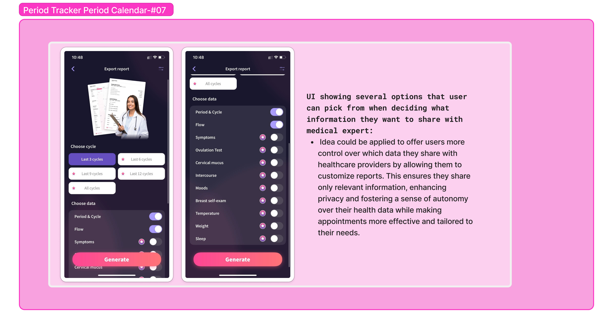

# Project Phase 2: Divergent Design 

## Background :information_source:

<b>App Name:</b> VitalCycle
 

<b>Intended Audience: </b>Menstruating individuals seeking a comprehensive tool to track their periods and gain support for their menstrual health, as well as both menstruating and non-menstruating individuals who are interested in learning about women's health and menstrual well-being.
 

<b>Intended Value:</b> VitalCycle will focus on effective tracking/menstrual health journaling habits and community-building for longer-term awareness, destigmatization, and health. In existing period trackers, there exist features like being able to log which days your period/symptoms occur and being able to get predictive insights based on your logged data. However, there is a lack of community in these spaces, which could help connect users to find information, support, and resources that are relevant to them. In our app, as well as having tracking features, we will empower users to ask for help in a stigma-free conversation environment with peers, which can, in turn, help those with more severe irregularities be more aware of their need for medical help and seek it out. 
## Scrapbook :notebook_with_decorative_cover:

### Flo

### Period Tracker Period Calendar

    
    
    
    
    
    
    
    
    
  

### Ovia Health

    
    
    
    

### Clue

    
    
    

### Glow

    
    

### Relieved

    
    

### Life

    

 

### Women's Health & Tips

    

 

## Feature Brainstorming :bulb:

- **Symptom logging:**  Allow users to log specific symptoms such as cramps, headaches, fatigue, acne, etc. Users can either choose from a predefined list of symptoms or write their own.

- **Mood Tracking:** Allow users to write down their mood or select from a list of emojis.

- **Pain Severity Tracker:**  Users can rate the severity of their pain for each symptom to monitor changes.

- **Calendar view of period cycle and logged symptoms:** Users can click on days in a calendar to see what symptoms/mood/pain severity they logged on that day, as well as what days they had their period

- **Calendar Integration:** Sync period and ovulation dates with external calendar apps to help users plan ahead.

- **Flow Intensity Tracker:** Allow users to track menstrual flow intensity (light, medium, heavy) to predict the next cycle with better accuracy.

- **Period Reminders:** Set automatic reminders for when to expect the next period, ovulation, or when to take medications (e.g., birth control).

- **Period Cycle Prediction:** Use data to predict the upcoming periods and ovulation based on past cycles.

- **Self-care checklists:** Offer a checklist for the user to follow during their cycle

- **Goal Setting and Habit Tracking:** Allow users to set personal health goals (e.g., drinking more water, regular exercise) and track their progress over time.

- **Health Library:** A collection of content(eg videos, articles ) offered by medical expert on different topics relating to women health

- **Localized Resource Finder:**  A feature that can help users know where to find different products or medications or resources that they might need for better health

- **Hormonal Health Dashboard:** A tool that can visualize hormonal trends for users and notify them how these trends could impact them

- **Partner Notification Feature:** Allows users to notify trusted partners about their cycle status for shared planning and understanding.

- **Social Challenge Integration:** Promotes healthy habits through challenges (e.g., hydration, consistent logging), rewarding user participation

- **Health Condition Integrator:** Allows tracking and management of conditions like PCOS, endometriosis, and anemia alongside cycle data.

- **Emergency Alert System:** A feature that entails notifying the user’s chosen emergency contacts in case of extreme symptoms being logged in or if an extreme trend is discovered.

- **Women’s Health Feed:** A feature(feed) that will include educational content about women’s health that non-menstruating people can use to get to know more about women’s health topics as talked about by experts or menstruating users who might opt to share their knowledge there.

- **Discussion Forum:** Users can create posts with text titles and bodies where they can ask questions or share solutions that are working for them. These posts are shared publicly with all users in the app. 

- **Anonymous Mode:** Before sharing a post, users have the option to enable "Anonymous Mode," which allows them to hide their identity and share content without revealing personal details.

- **Forum Visibility Control:** Users have the ability to toggle whether or not they wish to view the discussion forum in their app settings, providing a customizable experience tailored to individual engagement preferences.

- **Tag-Based Navigation:** Post creators can add tags to their content, categorizing it by topic. Users can filter posts by these tags to quickly find and engage with content relevant to their interests.

- **Title-Based Search:** A powerful search feature that lets users search for posts by their titles, making it easy to revisit and find posts they saw earlier.

- **Health Expert Verification Badge:** Users who are verified as health experts receive a special badge next to their username, distinguishing their posts in the forum and enhancing trust in their advice and information.

- **Event-Based Cycle Alerts:** Alerts users when their cycle may coincide with important dates (e.g., travel, exams, events) to allow for better planning.

- **Personalized Expert Consultations:** Users can schedule private, one-on-one meetings with verified health experts directly within the app, providing an opportunity for tailored, personalized guidance and support.

- **Ask the Expert Live:** An in-app Q&A feature where users can submit questions to healthcare professionals and receive direct responses, fostering a space for accurate, professional health insights.

- **Cycle-Specific Threads:** Users can participate in text reply threads specifically focused on period and menstrual health topics, ensuring discussions are relevant, supportive, and informative for individuals tracking their cycles.

- **Mood-Based Reactions:** Users can choose from a range of menstrual-health-themed emoji reactions, reflecting various moods or symptoms tied to the menstrual cycle. This adds depth and relatability to user engagement and interaction 

- **AI Cycle Companion:** When users post questions in the forum, an AI assistant powered by menstrual health insights and tailored data will provide instant, accurate responses. This feature ensures users receive timely support and information while also offering a human-like, compassionate touch to their inquiries.

## App Outline :clipboard:

1. **Concept:  Logging**

   **Purpose:** Allow users to log specific symptoms (cramps, headaches, fatigue, acne) via SymptomLog, journal mood with MoodLog, and track flow intensity with FlowLog. Users can either choose from a predefined list of symptoms or write their own. In addition, users can rate the severity of their pain for each symptom to monitor changes.

   **Operational Principle:**  The log entry interface is located on the app’s main page, making it quick and intuitive for users to log their daily symptoms. Each symptom, mood, or flow entry within the Logging concept captures a single day’s symptoms. To make a logged entry, users select from a predefined list or add custom symptoms. On each entry, they can also optionally log pain severity levels on a scale. Every entry is automatically timestamped, linking to a calendar view, where users can track and review their symptoms, flow, and mood changes over time. After creating an entry, users can click on this day in the calendar view to see what they logged.

2. **Concept: Checklisting**

   **Purpose:** Offer a checklist to remind users to complete essential tasks and build healthy habits throughout their cycle.

   **Operational Principle:** : When any symptom, mood, or flow intensity is logged,  a list of self-care actions (e.g., rest, hydration, meditation) will be dynamically generated that the user can complete and check off. The routines adapt based on logged symptoms and moods. Each user can have multiple checklists because previous checklists can be saved, stored, or popped back up throughout different parts of someone’s cycle!

3. **Concept: Posting**

   **Purpose:** Allow users to create posts that can be viewed by all other users. A forum contains a collection of public posts (standard concept). Each post has a text title and body where users can ask questions or share solutions that are working for them. Before sharing a post, users have the option to select whether or not they want to be anonymous. 

   **Operational Principle:** :  After pressing “create post” on the discussion forum page, the user will have blank “title” and “content” fields to populate as well as a checkbox asking if they would like to “post anonymously?” If they check it and then click “post,” the final post will have the creator marked as “Anonymous User.” Otherwise, the post displays the creator’s username.

4. **Concept: Replying[Item]**

   **Purpose:** Enable users to share their opinions and engage in conversations by writing replies to different items displayed in the app.

   **Operational Principle:** :  : Beneath specific items, users will find a “Reply” button. When clicked, a textbox appears for users to input their response. Once they submit their reply by clicking “Post Reply,” it will be displayed as an indented response below the original item, facilitating structured conversations and thoughtful interactions.

5. **Concept: Reacting[Item]**

      **Purpose:**  Allow users to show support and engagement by reacting to content created by other users through emojis, fostering a sense of community and connection.

      **Operational Principle:** :  Beneath relevant items, there is a “React” button. When clicked, users can choose from a set of four emojis to express their reaction. The selected emoji appears on the item, accompanied by a count indicating how many users have reacted similarly, providing a quick visual indicator of community sentiment and support. 

6. **Concept: Searching**

   **Purpose:** : Allow users to easily find content within the app by using keyword searches to locate posts, recorded moods, symptoms, and other items. 

   **Operational Principle:** : A search bar is prominently placed at the top of different views, enabling users to enter keywords. The search function retrieves matching elements, whether they are posts, logs, or other records, and presents them in a clickable list. This intuitive feature streamlines navigation and helps users quickly access desired content or revisit previous entries.

7. **Concept: Opting**

   **Purpose:** : Enable users to tailor their app experience by selecting which features they wish to access, such as discussion forums, mood tracking, self-care checklists, and more

   **Operational Principle:**  Within the user settings, there will be a section that displays a list of available app features, each accompanied by an opt-in/opt-out toggle. Users can activate or deactivate features based on their preferences. For instance, they can choose to disable the discussion forum while retaining tracking and self-care options, creating a personalized, streamlined app experience.

## Storyboards :movie_camera:

### Storyboard 01

     

In this first storyboard, the user has a headache and mentions that she notices this happens often during her period. She decides to start tracking her symptoms on the app so she will be able to predict better when her symptoms will occur. She starts doing this by selecting her mood for today and typing in the symptoms she’s experiencing today. She continues logging entries into this tracker regularly. Later, she realizes she has an event on a day where she would predict from her logged entries that her symptoms will be starting again. She decides to move the event and later is happy that because she did this, she is feeling well on this day.

### Storyboard 02

     

In this second storyboard, the user is experiencing symptoms from her period and is wondering if the app has any suggestions for her that will be helpful. She navigates to the forums page and sees many discussion posts by other users about different menstrual health topics. She uses the search bar at the top of the page to find posts about her symptoms and, within these, finds one post that seems relevant to her. She views the replies on this post and sees a user-suggested solution to her problem that she decides to try out. It works for her, and she feels much better. 

