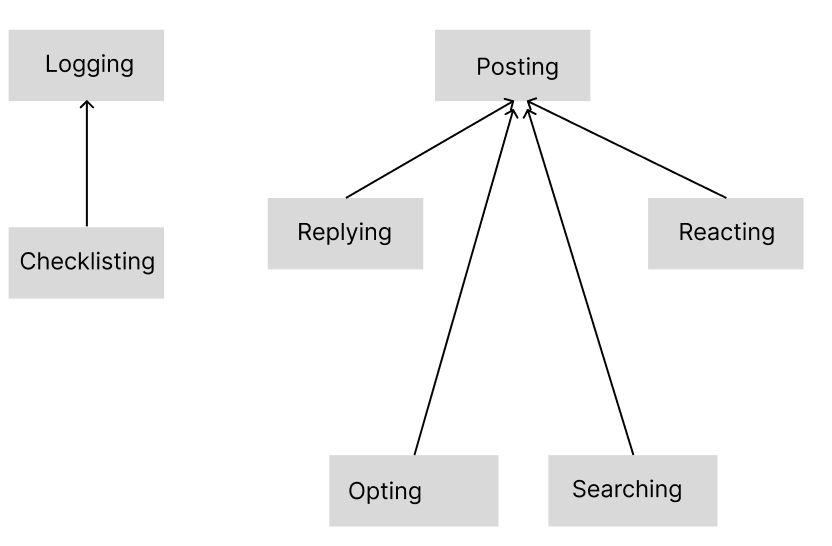
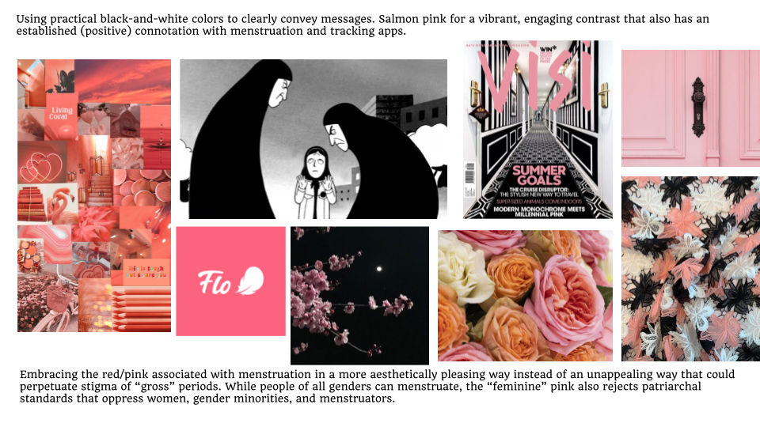
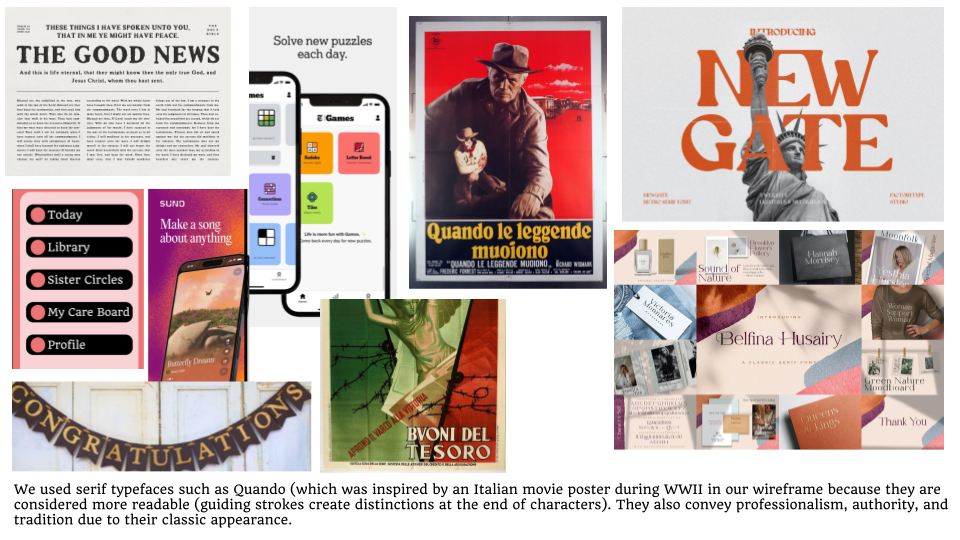

<style>
div.scroll-container {
  background-color: #333;
  overflow: auto;
  white-space: nowrap;
  padding:5px;
  margin-top:20px;
}
div.scroll-container img {
  padding: 5px;
  display:inline-block;
}
</style>

## Concepts :page_with_curl:


<details>

<summary><b>Concept 01</b></summary> 

<b>Concept:</b> Logging

<b>Purpose:</b> Allow users to log specific symptoms (cramps, headaches, fatigue, acne), journal mood, and track flow intensity. Users can either choose from a predefined list of symptoms or write their own. In addition, users can rate the severity of their pain for each symptom to monitor changes.


<b>Operational Principle:</b>   After a user “logs” an entry on a certain day, they can look back at their logged entries for that day, and the new entry will be shown.
 

<b>State</b>

- logEntries: set LogEntry // Collection of completed log entries
- logSymptoms: LogEntry → set Symptom // All symptoms (predefined or custom) recorded in an entry
- logMood: LogEntry → one Mood // Mood recorded in an entry
- logFlowIntensity: LogEntry → one IntensityLevel // Flow intensity recorded in an entry
- logTime: LogEntry → one DateTime // Timestamp of the log
    
<b> Actions </b>

```
createLogEntry(symptoms: set Symptom, customSymptoms: set String, mood: Mood, flowIntensity: IntensityLevel, out log: LogEntry)
{
    Adds a new log entry with specified symptoms (from the predefined list or user-defined), mood, and flow intensity.
    Precondition: At least one input (symptoms, mood, or flow intensity) is provided.
    Postcondition: Log entry is added to logEntries, with custom symptoms included in the logSymptoms set.
}
 ```

 ```
viewLogHistory(startDate: DateTime, endDate: DateTime, out logs: set LogEntry)
{
    Fetches logs within the specified date range.
    Precondition: Valid date range is provided.
    Postcondition: Returns matching logs from logEntries
}
 ```

 ```
deleteLogEntry(log: LogEntry)
{
    Deletes a log entry from the system.
    Precondition: Log entry exists in logEntries.
    Postcondition: Log entry is removed from logEntries.
}
 ```
</details>


<details>

<summary><b>Concept 02</b></summary> 

<b>Concept:</b> :  Checklisting 

<b>Purpose:</b> Offer a checklist to remind users to complete essential tasks and build healthy habits throughout their cycle. 


<b>Operational Principle:</b>   When a user opens their checklist they can mark tasks as completed and they then will show up as checked off. Later when the user opens their checklist they will see this entry stays as being checked off. Each day at midnight all entries on the checklist are marked as uncompleted. A user can add new tasks to their checklist and they will be added and show up as initially uncompleted. 
 

<b>State</b>

- userChecklists: User → set Checklist // Maps users to their checklists
- checklistTasks: Checklist → set Task // Tasks contained in a checklist
- taskStatus: Task → Boolean // Status of a task (True if completed, False otherwise)
    
<b> Actions </b>

```
createChecklist(user: User, tasks: set Task, out checklist: Checklist)
{
    Creates a new checklist for the user with specified tasks.
    Precondition: User exists and tasks are provided.
    Postcondition: Checklist is added to the user’s userChecklists.
}
 ```

 ```
editChecklist(checklist: Checklist, updatedTasks: set Task)
{
    Edits the tasks within an existing checklist.
    Precondition: Checklist exists in the user’s userChecklists.
    Postcondition: The tasks in the checklist are replaced with updatedTasks.
}
 ```

 ```
markTaskComplete(checklist: Checklist, task: Task)
{
    Marks a specific task in the checklist as completed.
    Precondition: Task exists in the checklist.
    Postcondition: Task’s taskStatus is updated to True.
}
 ```

  ```
deleteChecklist(user: User, checklist: Checklist)
{
    Deletes a checklist for the user.
    Precondition: Checklist exists in the user’s userChecklists.
    Postcondition: Checklist is removed from the user’s userChecklists.
}
 ```

   ```
retrieveChecklists(user: User, out checklists: set Checklist)
{
    Fetches all checklists for the user, including active and completed ones.
    Precondition: User exists.
    Postcondition: Returns all checklists in the user’s userChecklists.
}
 ```
</details>


<details>

<summary><b>Concept 03</b></summary> 

<b>Concept:</b>  Posting[Post]

<b>Purpose:</b> Allow users to create posts that can be viewed by all other users. A forum contains a collection of public posts (standard concept). Each post has a text title and body where users can ask questions or share solutions that are working for them

<b>Operational Principle:</b>    After posting a “Post” all users of the app are able to see the posted content. When a user creates a post marked as a “CareBoard” post, it is shown on this user’s personal “CareBoard” page. Other posts become visible as a SisterCircles post.

 

<b>State</b>

- forumPosts: set Post // Collection of all posts
- postTitle: Post → one String // Title of the post
- postContent: Post → one String // Content of the post
- postCreator: Post → one User // User who created the post
- postAnonymity: Post → Boolean // Anonymity flag for the post
- postTags: Post → set Tag // Tags associated with the post
- postTimestamp: Post → one DateTime // Timestamp when the post was created

    
<b> Actions </b>

```
createPost(title: String, content: String, tags: set Tag, anonymous: Boolean, out post: Post)
{
    Creates a post with the specified title, content, tags, and anonymity setting.
    Precondition: Title and content are non-empty.
    Postcondition: Post is added to forumPosts with a generated timestamp and attributes.
}
 ```

 ```
viewPosts(out posts: set Post)
{
    Retrieves all posts in the forum.
    Precondition: None.
    Postcondition: Returns all posts in forumPosts.
}
 ```

 ```
filterPostsByTag(tag: Tag, out posts: set Post)
{
    Retrieves posts that include the specified tag.
    Precondition: Tag exists in at least one post.
    Postcondition: Returns all posts in forumPosts where tag ∈ postTags.
}
 ```

  ```
sortPostsByTimestamp(order: String, out posts: set Post)
{
    Retrieves posts sorted by their timestamps in ascending or descending order.
    Precondition: Order is either "asc" or "desc".
    Postcondition: Returns posts sorted by postTimestamp 
}
 ```

  ```
deletePost(post: Post)
{
    Removes a post from the forum.
    Precondition: Post exists in forumPosts.
    Postcondition: Post is deleted from forumPost
}
 ```
</details>

<details>

<summary><b>Concept 04</b></summary> 

<b>Concept:</b>  Replying[Post]

<b>Purpose:</b> Users can create text replies on one Post


<b>Operational Principle:</b>  When a user “replies” to a Post, a textbox appears. After putting text into it, the text will now appear under the original post. 

 

<b>State</b>

- postReplies: set Reply // Collection of all replies
- replyContent: Reply → one String // Text content of the reply
- replyCreator: Reply → one User // User who created the reply
- replyParentPost: Reply → one Post // Post the reply belongs to
    
<b> Actions </b>

```
createReply(post: Post, content: String, out reply: Reply)
{
    Adds a reply to the specified post.
    Precondition: Post exists in forumPosts, and content is non-empty.
    Postcondition: Reply is added to postReplies and linked to the post.
}
 ```

 ```
viewReplies(post: Post, out replies: set Reply)
{
    Fetches all replies for a post.
    Precondition: Post exists in forumPosts.
    Postcondition: Returns replies linked to the post.
}
 ```


</details>

<details>

<summary><b>Concept 05</b></summary> 

<b>Concept:</b>  Reacting[Post]

<b>Purpose:</b>   Users can create emoji “reactions” to a Post created by other users. 


<b>Operational Principle:</b>   When a user “reacts” to a Post, they can select from four emojis, and after selecting one it appears on the corner of the post with a number indicating how many people have reacted to the same Post with the same emoji. 

 

<b>State</b>

- postReactions: set Reaction // Collection of all reactions
- reactionType: Reaction → one Emoji // Emoji used for the reaction
- reactionPost: Reaction → one Post // Post the reaction belongs to
- reactionCount: Reaction → Integer // Count of reactions for a specific emoji
    
<b> Actions </b>

```
addReaction(post: Post, emoji: Emoji)
{
    Adds an emoji reaction to a post.
    Precondition: Post exists in forumPosts.
    Postcondition: Reaction is recorded and reactionCount is incremented.
}
 ```

 ```
viewReactions(post: Post, out reactions: set Reaction)
{
    Fetches reactions for a post.
    Precondition: Post exists in forumPosts.
    Postcondition: Returns reactions linked to the post.
}
 ```
</details>

<details>

<summary><b>Concept 06</b></summary> 

<b>Concept:</b>  Opting

<b>Purpose:</b>   Users can select in the app’s settings whether or not they want to be able to access a certain feature, such as the discussion forum, mood tracking, self-care checklist, etc. 


<b>Operational Principle:</b>    If a user opts out of a specific feature (by unchecking it’s associated check-box), it is no longer visible for them in the app. It becomes visible for them only if they opt back in.

 

<b>State</b>

- featureSettings: User → set Feature // Enabled features for each user
    
<b> Actions </b>

```
toggleFeature(user: User, feature: Feature, enable: Boolean)
{
    Updates the user’s settings to enable or disable a specific feature.
    Precondition: Feature exists in the system.
    Postcondition: If enable is True, the feature is added to the user’s featureSettings. If False, the feature is removed.
}
 ```

 ```
getStatus(user: User, feature: Feature, out status: Boolean)
{
    Retrieves the current enable/disable status of a specific feature for the user.
    Precondition: Feature exists in the system.
    Postcondition: Returns True if the feature is in the user’s featureSettings; otherwise, returns False.
}
 ```
</details>


## Concept Synchronizations :arrows_counterclockwise:

Toggle Features

Purpose: Allow users to enable or disable specific features in the app.

Synchronization Flow:
Call toggleFeature (from Opting) with the user, feature, and desired status (enabled/disabled).

Interact With Posts:

Purpose: Allow users to reply to posts or react with emojis.

Synchronization Flow:

To reply: Call createReply (from Replying[Post]) to add a reply to a specific post.

To react: Call addReaction (from Reacting[Post]) to add an emoji reaction to the post.

Daily Logging

Purpose: Allow users to log their daily symptoms, mood, and flow intensity.

Synchronization Flow:

Call createLogEntry (from Logging) to create a log entry with symptoms, mood, and flow intensity.
If logging results in tasks being identified for self-care: Call createChecklist (from Checklisting) to generate a new checklist for the user with tasks based on the logged entry.

Post to forum:

Purpose: Allow users to post in the forum with tags and optional anonymity.

Synchronization Flow:
Call createPost (from Posting) to create a new post with a title, content, tags, and anonymity status.
If the post is marked as a "CareBoard" post: Tag it accordingly, and ensure it is displayed in the user’s "CareBoard" page.
If the post is a "SisterCircles" post: Display it publicly in the forum.


## Dependency Diagram :pencil:

  


## Wireframes :notebook_with_decorative_cover:

The **Vital Cycle** wireframes outline the foundational user interactions and layout for a comprehensive menstrual health and wellness app. These wireframes highlight key features, including **My Care Board**, a personalized message board where users can share daily symptoms or notes on how they feel, allowing their trusted care circle to respond and provide support. Symptom logging enables users to track their health and decide whether to share this data with their care circle or post it publicly. A daily checklist helps users manage personal tasks, while robust options for data sharing and building a support system give users complete control over their privacy. Sister Circles offer topic-specific feeds for community discussions, and the Health Library provides curated information tailored to the user’s cycle day, with additional topics available for exploration. While not all interactions are shown, the wireframes effectively present essential user flows, such as managing the care board, tracking symptoms, and engaging in sister circles, all reflecting the app’s mission to empower users with knowledge, connection, and personalized support.


 <a href="https://www.figma.com/proto/KiqK5UznD9noc3ZlJzBijf/VitalCycle?page-id=0%3A1&node-id=75-3017&node-type=frame&viewport=-52%2C-41%2C0.21&t=4C7FCiBaG4OTbfBw-1&scaling=min-zoom&content-scaling=fixed&starting-point-node-id=15%3A7">Interactive Prototype for VitalCycle</a>

 <a href="https://www.figma.com/design/KiqK5UznD9noc3ZlJzBijf/VitalCycle?node-id=75-3017&t=Cysq9Hf2BFZRqPW4-1">Figma Wireframes for VitalCycle</a>


 ## Heuristic Evaluation :microscope: 

 ### Usability Criteria 


 <div style="margin-left:20px">
 
 1. <h4>Discoverability: how rapidly and easily can users understand how to operate the interface?</h4>
 <div style="margin-left:20px">

- The sidebar where users can navigate to any of the main pages of the app (Today, Library, Sister Circles, My Care Board, and Profile) stays consistently in one place. Significant space is given to the sidebar so users are able to find these different pages easily (more discoverable).
- To access past logs of period symptoms, users must first click the calendar icon and then select a day to view. This feature is less discoverable because it is hidden behind an icon instead of just having the whole calendar visible on the page. However this is a trade off because it allows us to give more space on the page to current day’s log/symptoms.
- On the “Today” page we include simple labels in each section, for instance, “How did your day go…”, “Mood”, “Flow Intensity”, etc. explain to the user what each section is so they better understand what it is for and how to interact with it.
- On the “Library” page, we use consistent icons for the posts and group them into labeled sections to make it easier for the user to understand what they are for
- The “Share Your Daily Log” and the “Daily Checklist” use very similar interfaces so the user can more rapidly understand how to use them.
- Users can view posts on the Sister Circles page by scrolling down through them. This is a common way of viewing posts on other websites and makes it more intuitive for the user to learn how to do this.
</div>

 2. <h4>Safety: how does the interface guard against people making mistakes?</h4>
 <div style="margin-left:20px">
 
- Since the sidebar is visible on all pages of the app, if a user accidentally navigates to the wrong page, they can easily fix this by selecting the correct page in the sidebar

- Buttons on the app like “Export” or “Daily Checklist” have a clear way to close out of the pop-ups if the user accidentally presses them (pressing the x button in the top right). Buttons like symptom/mood/flow selections can be clicked again to un-select them.

- We don’t currently have this in our Wireframes, but something we should add to better support this heuristic is a way for users to delete posts or comments that they made if they later decide that they want them taken down. Similarly, we should add a way for users to remove tasks from their daily checklist. 
- Users can use the calendar icon on the “Today” page to navigate past logs and modify any previous entries that they made.
</div>

 </div>

  ### Physical Heuristics 


 <div style="margin-left:20px">
 
 1. <h4>Mapping: does the layout of the interface elements match their function?</h4>
 <div style="margin-left:20px">

- As mentioned earlier, the sidebar stays consistent on the screen so that the user can easily navigate to any page of the app. Within the sidebar there are different buttons stacked vertically that users can click on to navigate to a page. These buttons are grouped together, consistently styled, and well labeled, but we might want to add in a title above them like “Pages” or “Navigate To” on the sidebar so their function is more clear.

- On the “Today” page, the date is in big font at the top of the page. This gives the user context for what the page is before looking at the logged information below it. The symptom/mood/flow choices are all grouped together in their own designated sections and have a consistent layout to convey that the user interacts with them in the same way.

- On the “Profile” page, all of the buttons to interact with (ex: view general trends, go general settings, see reminders, etc.) are all grouped together and stacked vertically in the center of the page. This matches their function because the user can easily look through this list to see which action they are looking for and then choose the corresponding one. They use the same layout/styling to show that the user interacts with them in the same way.

- On the “My Care Board” page, each individual post has its parts grouped together in one section, including the title, date it was posted, post contents, and the replies/”see replies” button. By laying out these elements and grouping them together in one box, we show the user that they all correspond to this one post.

</div>

 2. <h4>Situational context: how does the interface convey to a user their context (where they are, the app’s state, etc.), and how does it adapt to their context?</h4>
 <div style="margin-left:20px">
 
- In the sidebar we highlight in a different color which page the user is currently on (Today, Library, Sister Circles, My Care Board, Profile). Something else we could add in to better convey this context is a title at the top of each page also with these labels. Some of the pages have this already but for example it is missing on the “Today” page and the “Profile” page.

- On the “Sister Circles” page we are showing at the top which circles the user has added. We are also showing which they are currently viewing by highlighting this option. Additionally when a user clicks the “Add Circle” button, we remove from the recommended to join options the circles the user has already joined (so they know they cannot add them in again), and don’t let them show up if they search specifically for them again.

- Something that’s not in our wireframe but could better convey situational context is on posts with no replies have a label like “no comments made on this post yet” to help the user understand why there is nothing below a post when they see comments on some other ones. Similarly if a user hasn’t published anything on their “My Care Board” page, it should show a message like “Nothing posted yet”. 
- In the “Library” page we are highlighting which topics of interest the user has currently selected to view, and when the user adds a new one, a new section appears below the “topics of interet” box with library entries for this section. When a user deselects a topic by clicking it again, this section will disappear (adapting to their context).
</div>

 </div>

   ### Linguistic Level 


 <div style="margin-left:20px">
 
 1. <h4>Speak a user’s language: does the interface use simple, helpful, informative messages? Are there instances where messages might only be understandable by developers?</h4>
 <div style="margin-left:20px">

- On the “Today” page we are using simple informative messages for each of the sections so that the user can understand what they are for. For instance, labels like “How did your day go”, “Mood”, “Flow Intensity”, and “Symptoms” are easily understood by the user. Something that could make the options below these section titles even more intuitive could be to add icons, for instance emoji/face icons for the different mood options.

- I think something we could improve on for this heuristic is the naming of the different pages of the app. For instance, a new user probably won’t understand what “Sister Circles” means, what the “Library” will contain, or that on the “Today” page, you can actually access logs from other previous calendar days as well. Some other options we could consider for naming these to speak the user’s language better are “My Logs” or “My Tracker” instead of “Today,” “Menstrual Health Information Library” or “Information Resources” instead of “Library,” and “Community Posts” or “User Discussions” instead of “Sister Circles

- Something outside our wireframe that we could add to better support this heuristic is short informative alert messages that show up after user interaction with the interface. For example, after a user creates a post, a message like “Post created successfully” shows up, or after the user selects a new “sister circle” to join, a message like “joined the circle [circle name]” shows up. These simple messages would speak the user’s language and would better help them understand what their interactions with the user interface are doing.


</div>

 2. <h4>Consistency: does the interface reuse the same names, symbols, and icons for the same concepts or actions? How consistent is the interface with others across the same application domain or platform?</h4>
 <div style="margin-left:20px">
 
- Across all of the options in the Mood, Flow Intensity, and Symptoms sections, we are using the same button interface to show that the interaction with these elements is the same. 

- The “How did your day go” section is inconsistent with the rest of the sections on the “Today” page (because it uses a different interaction). This is a tradeoff because having a section that’s different than how you interact with the rest of the sections on the page could be confusing for the user, but by allowing the user to write in responses instead of just selecting from a pre-chosen set, we are giving them more freedom to choose what they want to log for this day. By leaving the other sections as pre-chosen buttons they can select, we are still giving the user the option to quickly create a log if they don’t have much time/don’t have the effort to write a response.

- In the “Library” page, we use consistent styling for each of the library entries (across the different topics). Also, the “Topics of Interest” in the Library page styling/interaction as the circles selection in “Sister Circles.” This consistency makes it more intuitive for the user to understand how to interact with this element.
</div>

 </div>

 ## Design Study :books:

 <div class="scroll-container">
     
    
 </div>

  <a href="https://www.figma.com/design/KiqK5UznD9noc3ZlJzBijf/VitalCycle?node-id=75-3017&t=Cysq9Hf2BFZRqPW4-1">Google Slides: Design Study</a>

 ## Project Plan :page_with_curl:

 ### Ordering Implementation of Concepts: 
<div style="margin-left:20px">

1. <h4> Logging </h4>
<div style="margin-left:20px">
<u> Tasks</u>

- Create Logging class, initialize database, write methods to populate the database
    - ASSIGNED TO: Nora, DEADLINE: 27th November
- Create front-end interaction to select different options for mood, symptoms, etc. and type in notes. Create a route that given these selections stores this information for the user’s associated account in the database. Call the route from the front-end.
    - ASSIGNED TO: Nisha, DEADLINE: 27th November
- Create a front-end interaction for opening a calendar view where the user can select a date. Create and call a route from the front end for loading from the database the users logged entries on a specific date.
    - ASSIGNED TO: Nisha, DEADLINE: 27th November
- Create a route that, given as input a specific user, looks back at their previous entries to calculate their “cycle trends” like “average cycle length”, “average period length”, etc. Create a front-end interaction to display this.
    - ASSIGNED TO: Sam DEADLINE: 27th November
- Create a “Today” page (“view”) in the app, use CSS/Bootstrap to layout page in way shown in the Wireframes
    - ASSIGNED TO: Sam, DEADLINE: 3 December
</div>

2. <h4> Posting </h4>
<div style="margin-left:20px">
<u> Tasks</u>

- Create a Posting class, initialize database collections - one for Sister Circles posts and one for Care Board posts, and write methods to populate/remove posts from the collections
    - ASSIGNED TO: Ao, DEADLINE: 27th November
- Create a front-end interaction for creating a new post (users can type in a caption and select a sister-circle). Create and call a route that will create a post with this content and store the post in the database, associating it with this specific circle.
    - ASSIGNED TO: Nora, DEADLINE: 27th November
- Create front-end interaction & backend route for users to join specific circles.
    - ASSIGNED TO: Nisha, DEADLINE: 27th November
- Create a route that, when given a specific circle as input, gets all of the posts within this circle. Create a front-end interaction (using this route) for users to switch between different circles they joined and view the posts in this circle
    - ASSIGNED TO: Nisha, DEADLINE: 27th November
- (Not in Posting concept, but a synchronization): Create a route for exporting logged data into creating a post (either in Care Board or Sister Circles)
    - ASSIGNED TO: Sam, DEADLINE: 27th November

- Layout Sister Circles page (“view”) using CSS/Bootstrap to match Wireframes 
    - ASSIGNED TO: Nisha, DEADLINE: 5th December

- Layout My Care Board page (“view”) using CSS/Bootstrap to match Wireframes 
    - ASSIGNED TO: Nisha, DEADLINE: 5th December

- Create a route and front-end interaction for searching Sister Circle posts by what they contain in their post-caption.
    - ASSIGNED TO: Nora, DEADLINE: 27th November

</div>

3. <h4> Replying </h4>
<div style="margin-left:20px">
<u> Tasks</u>

- Create a Replying class and initialize collections to store all of the replies on the posts. To implement this concept, we might want two collections - one for replies on the CareBoard and one for replies on Sister Circles (but we could also choose to have just one). Create methods for populating/removing info from the collection(s).
    - ASSIGNED TO: Sam, DEADLINE: 5th December
- Create front-end interaction for users to reply to a specific post (taking in the post-id they are replying to, the user ID of the user replying, their text reply,  and the current time). Create a route to save this in the database and call it. 
    - ASSIGNED TO: Ao, DEADLINE: 27th November
- Create a front-end interaction & route for getting all of the replies on a specific post. 
    - ASSIGNED TO: Nora, DEADLINE: 5th December

</div>

4. <h4> Checklisting </h4>
<div style="margin-left:20px">
<u> Tasks</u>

- Create a Checklisting class and initialize a collection to store what items are in each user’s daily log and which they have checked off. Create methods for adding/removing data from this collection. Additionally, store in the collection the last date/time a user has opened the checklist so if it gets opened again on a separate day, what they checked off gets refreshed.
    - ASSIGNED TO: Sam, DEADLINE: 5th December
-   Create a front-end interaction & route for loading (displaying) the checklist for a specific user when they open the daily log. 
    - ASSIGNED TO: Nora, DEADLINE: 5th December
- Create front-end interaction & route for checking items off the list
    - ASSIGNED TO: Ao, DEADLINE: 5th December
- Create front-end interaction and route for adding a new daily goal
    - ASSIGNED TO: Sam, DEADLINE: 5th December
</div>

5. <h4> Opting </h4>
<div style="margin-left:20px">
<u> Tasks</u>

- Create Opting class and initialize a collection to store which things the user has opted into. Create methods to add/remove data from this collection.
    - ASSIGNED TO: Ao, DEADLINE: 5th December
- Create front-end interaction/route for users to opt in/out of different features.
    - ASSIGNED TO: Ao, DEADLINE: 5th December
- Create a route to get the opted-in features for a specific user. Modify features/pages to correspond with only what features the logged-in user has opted into (for instance, if the user has not opted into the Sister Circles, this page should not show up for them)
    - ASSIGNED TO: Ao, DEADLINE: 5th December

</div>

6. <h4> Reacting </h4>
<div style="margin-left:20px">
<u> Tasks</u>

- Create a Reacting class and initialize a collection to store the number of/kind of reactions for each post. Create methods to add/remove data from this collection.
    - ASSIGNED TO: Nora, DEADLINE: 5th December
- Create a front-end interaction to react to a post (choosing from a set of emoji reactions). Create and call a route to store this in the database.
    - ASSIGNED TO: Nora, DEADLINE: 5th December
- Create a front-end interaction and route to get the emoji reactions on a specific post. Display the
    - ASSIGNED TO: Nora, DEADLINE: 5th December


</div>

</div>


### What We Will Do If Something Goes Wrong:

If we aren’t able to complete these tasks by their deadlines, we can consider dropping certain tasks. The concepts we want to make sure we implement are Logging, Posting, Replying, and Checklisting. The other three concepts would improve our app, but don’t include main features and if we don’t have enough time to complete them we could consider dropping these and still have the minimum viable product. In general though we expect each team member to complete the tasks they were assigned and are responsible for


 